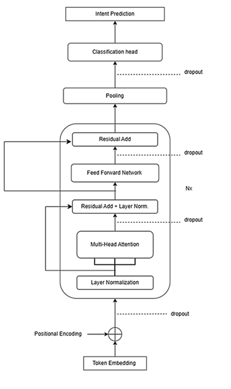

# 🧠 Intent Classification Using Transformer

A from-scratch Transformer-based NLP system for banking intent classification, paired with a lightweight chat UI and a FastAPI backend for real-time query routing. Built around the **BANKING77** dataset (77 fine-grained banking intents), the project demonstrates how a custom transformer encoder head, trained on top of frozen BERT embeddings, performs against a simpler linear-probe baseline — including entropy-driven confidence checks that decide when to escalate a query to a human agent.

---

## 🚀 Project Overview

Intent classification is a core building block for chatbots, virtual assistants, and automated query routing. This project takes BERT's contextual embeddings and freezes them, then trains a custom transformer encoder + classification head on top to predict one of 77 banking intents from a user's message.

The project is a full-stack demo:

- 🧠 A custom transformer classifier trained on frozen `bert-base-uncased` embeddings
- ⚖️ A linear-probe baseline for comparing against the custom transformer layers
- ⚙️ A FastAPI backend (`main.py`) serving real-time predictions
- 💬 A simple HTML/JS chat UI (`index.html`) for interacting with the model

---

## 🏗️ Architecture

```
User Input (Chat UI)
      ↓
FastAPI Backend  (main.py)
      ↓
Text Preprocessing → BertTokenizer → Frozen BertEmbedder
      ↓
IntentClassifier (Transformer Encoder + Classification Head)
      ↓
Softmax → Entropy / Confidence Check → Intent or Escalate to Agent
      ↓
JSON Response → Chat UI renders reply
```



## 🎥 Demo

A short walkthrough of the chat UI in action, showing a query being classified and routed in real time:

▶️ [Watch the demo](https://youtube.com/shorts/YE031101hPw?feature=share)

### 🔹 Components

| Layer                   | Description                                                              |
| ----------------------- | -------------------------------------------------------------------------|
| **Chat UI**              | `index.html` — minimal chat interface for testing predictions           |
| **FastAPI Backend**      | `main.py` — exposes the prediction endpoint(s)                          |
| **Tokenizer**            | `BertTokenizer` (`bert-base-uncased`) via `text_preprocessing/`         |
| **Embedder**             | Frozen `bert-base-uncased` embeddings (not fine-tuned)                  |
| **Model**                | `model.py` — custom `IntentClassifier` (transformer encoder + head)     |
| **Baseline**             | `linearprobe.ipynb` / `linearprobepredict.ipynb` — linear probe on top of the same frozen embeddings |
| **Escalation Logic**     | Confidence threshold + entropy check to flag uncertain predictions for human handoff |

---

## 📁 Project Structure

```
.
├── index.html                    # Chat UI (frontend)
├── main.py                       # FastAPI backend / entry point
├── model.py                      # IntentClassifier model definition
├── data_study.ipynb              # Exploratory analysis of BANKING77
├── training.ipynb                # Training loop for the custom transformer
├── testing.ipynb                 # Evaluation on the held-out test set
├── prediction.ipynb              # Ad-hoc inference / qualitative checks
├── linearprobe.ipynb             # Linear-probe baseline (frozen embeddings)
├── linearprobepredict.ipynb      # Inference with the linear-probe baseline
├── text_preprocessing/           # Tokenization and embedding utilities
├── archdiag.png                  # Architecture diagram
├── LICENSE
└── README.md
```

---

## 📚 Dataset

- **BANKING77** — a fine-grained banking customer service intent dataset
- **77** intent classes
- Frozen `bert-base-uncased` embeddings used as fixed input representations

---

## 🛠️ Tech Stack

| Layer            | Technology                    |
| ----------------- | ----------------------------- |
| Language          | Python 🐍                      |
| Deep Learning     | PyTorch 🔥                     |
| NLP Models        | Hugging Face Transformers 🤗   |
| Backend API       | FastAPI ⚡                     |
| Frontend UI       | HTML / Vanilla JS 💬            |

---

## ⚙️ Installation

```bash
git clone https://github.com/Intent-Classification/Intent-Classification-Using-Transformer.git
cd Intent-Classification-Using-Transformer
pip install -r requirements.txt
```

> Note: if `requirements.txt` isn't present yet, install the core dependencies manually: `torch`, `transformers`, `fastapi`, `uvicorn`, `scikit-learn`, `numpy`, `pandas`.

---

## ▶️ Usage

### 1. Explore and train

Start with `data_study.ipynb` to understand the BANKING77 label distribution, then run `training.ipynb` to train the custom transformer classifier on frozen BERT embeddings. Use `linearprobe.ipynb` to train the baseline for comparison.

### 2. Evaluate

Run `testing.ipynb` to reproduce evaluation metrics on the held-out test set, and `prediction.ipynb` / `linearprobepredict.ipynb` for qualitative, example-by-example inference from each model.

### 3. Serve predictions

```bash
uvicorn main:app --reload --port 8000
```

> Update the model checkpoint path in `main.py` to point to your trained weights before running.

### 4. Use the chat UI

Open `index.html` directly in your browser. It talks to the locally running FastAPI backend.

---

## 🤖 Escalation Logic

Predictions below a confidence threshold, or with high output entropy (an uncertain, spread-out softmax distribution), are flagged for escalation rather than returned as a confident intent — a simple guardrail against wrong-but-confident-looking automation in a customer-facing setting.

---

## ⚖️ Custom Transformer vs. Linear Probe

A key question this project investigates is *when the extra transformer encoder layers earn their keep* over a simple linear probe on the same frozen BERT embeddings. The two notebook pairs (`linearprobe*.ipynb` vs `training.ipynb`/`prediction.ipynb`) are structured to make that comparison directly — useful for looking at near-boundary intent pairs, token-level saliency, and confidence calibration differences between the two approaches.

---

## 🚧 Challenges

- Class imbalance and semantic overlap across 77 fine-grained banking intents
- Distinguishing near-boundary intents where a linear probe and the custom transformer disagree
- Calibrating confidence thresholds so escalation triggers reliably without being overly conservative

---

## 🔮 Future Improvements

- Data augmentation for underrepresented intent classes
- Docker containerization for easier deployment
- Automated evaluation/CI pipeline for model updates
- Streaming responses for lower perceived latency

---

## 🎯 Applications

- 🏦 Banking virtual assistants
- 🤖 Customer support chatbots
- 📞 Automated query routing with human-in-the-loop escalation

---

## 🤝 Contributing

Pull requests are welcome. For major changes, please open an issue first to discuss what you'd like to change.

---

## 📜 License

Licensed under the [MIT License](./LICENSE).